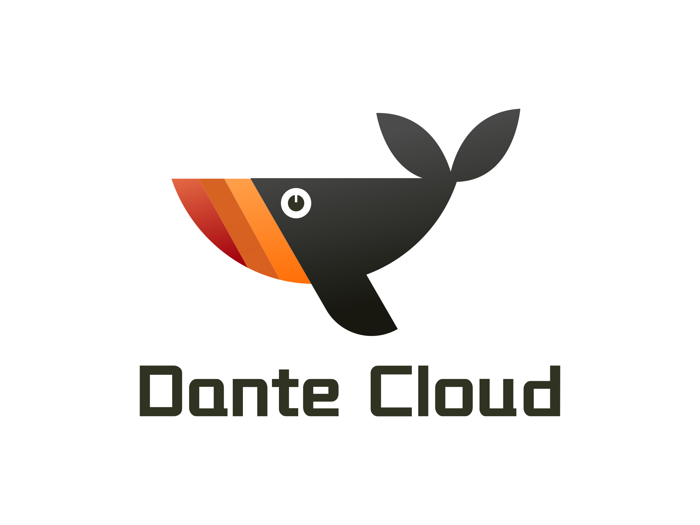

<p align="center"></p>
<h2 align="center">简洁优雅 · 稳定高效 | 宁静致远 · 精益求精 </h2>
<p align="center">Dante Engine 基于 Spring Boot 3.X， 是 Dante Cloud 微服务架构内核核心组件库，可用于任何 Spring Boot 工程</p>

---

<p align="center">
    <a href="https://github.com/spring-projects/spring-authorization-server" target="_blank"></a>
    <a href="https://spring.io/projects/spring-boot" target="_blank"></a>
    <a href="https://spring.io/projects/spring-cloud" target="_blank"></a>
    <a href="https://github.com/alibaba/spring-cloud-alibaba" target="_blank"></a>
    <a href="https://github.com/Tencent/spring-cloud-tencent" target="_blank"></a>
    <a href="https://nacos.io/zh-cn/index.html" target="_blank"></a>
</p>
<p align="center">
    <a href="#" target="_blank"></a>
    <a href="https://bell-sw.com/pages/downloads/#downloads" target="_blank"></a>
    <a href="./LICENSE"></a>
    <a href="https://www.herodotus.cn"></a>
    <a href="https://blog.csdn.net/Pointer_v" target="_blank"></a>
    <a href="https://gitee.com/dromara/dante-cloud"></a>
    <a href="https://gitee.com/dromara/dante-cloud"></a>
    <a href="https://gitee.com/dromara/dante-cloud"></a>
    <a href="https://gitee.com/dromara/dante-cloud"></a>
</p>
<p align="center">
    <a href="https://github.com/herodotus-cloud/dante-cloud">Github 仓库</a> &nbsp; | &nbsp;
    <a href="https://gitee.com/dromara/dante-cloud">Gitee 仓库</a> &nbsp; | &nbsp;
    <a href="https://www.herodotus.cn">文档</a>
</p>

<h1 align="center"> 如果您觉得有帮助，请点右上角 "Star" 支持一下，谢谢！</h1>

## 项目由来

作者本人过往工作，主要专注企业信息化项目建设，经手过大大小小、各式各样、规模各异的项目粗略估算也有 180+。这些项目经历，足以让我体会IT行业的千滋百味。回顾过往，发现其中很多工作，特别是很多会占用技术人员大量时间和精力的工作，大多数情况下并不是像技术攻关、新技术研究、业务架构设计、并发性能调优等有挑战性的工作，而往往都是因细节考虑欠缺、代码质量不高、在用技术老旧、欠缺优化迭代、系统难于维护、项目管理不善等问题产生的需要长期投入的、低效、低意义工作。

**这也是为什么做 Dante Cloud 的初衷**：一方面是以 Dante Cloud 为载体，潜移默化地将过往经验教训融入其中，尽可能地帮助使用者规避或者减少无效工作，提升工作效率和质量，有跟多的时间做更有意义的事情；另一方面不断地融合和使用各类新兴技术，帮助使用者尽可能多的了解、学习和运用新技术，让技术不再成为禁锢变为进步和提升的基石。

**这也是为什么 Dante Cloud 与其它项目不同**：Dante Cloud 并不关注常规应用功能的堆叠与丰富化，因为作者认为纯开发工作仅占整个项目建设投入的 20%，减少开发投入、提升开发效率未必就能减少整个项目建设周期剩余80%工作投入。Dante Cloud 的远景目标是可以帮助使用者缩短整个项目的建设周期和减少无意义的工作投入，而不仅仅只是在开发效率方面的提升。

> Dante Cloud 一直秉承“简洁、高效、包容、务实”的理念，不会采取任何额外的手段来获取更多的 Star，绝对真实就像其产品一样。如果你认可和喜欢 Dante Cloud，请不要吝啬你的赞美，项目右上角点颗小星星。

## 项目特点

1. 严格遵照“单一职责”原则，进行各个模块的划分和代码拆解。
2. 严格遵循 Spring Boot 编码规则和命名规则。
3. 大多数模块均支持 @EnableXXX注解 和 starter，让 Spring Bean 的注入顺序更加可控。
4. 模块化设计思想，通过 Bean 注入、以及丰富的自定义 @ConditionalXXX 注解，让模块的添加和删除更加灵活。
5. 各模块既可以综合在一起使用，也可以在其它 Spring Boot 工程中独立使用。

很多朋友不理解这样做的好处，明明很多代码都可以放在一起，为什么要拆分出这么多包、拆这么细？

这样做主要有以下优势：

1. 虽然模块看似很多，但是每个模块职责单一、代码清晰，更有利于聚焦和定位问题。
2. 通过对微服务架构的“庖丁解牛”，初学者不再需要在代码的海洋里“遨游”，通过针对性地了解各个模块，以点带面快速掌握微服务架构整体结构。
3. 模块间的依赖极大的降低，想要替换为 `Spring Authorization Server` ，影响到的代码和范围将会很小。该工程也是使用 `Spring Authorization Server` 的前序工作
4. 每个模块均是最小化依赖第三包，规避依赖包过度依赖，特别是 starter 过多依赖，导致不可预知、难以调试、不好修改等问题。
5. 降低微服务系统代码量，独立组件可提前编译并上传至Maven仓库，降低工程代码编译耗时，改进 CICD 效率。

## 工程结构

```
dante-engine
├── dependencies -- 工程Maven顶级依赖，统一控制版本和依赖
├── documents -- 需要放置的文档位置
├    └── readme -- README 相关素材放置目录
├── engine-access -- 外部登录接入模块
├    ├── access-core -- 外部登录通用代码
├    ├── access-sdk-all -- 外部登录集成
├    ├── access-sdk-justauth -- JustAuth登录
├    ├── access-sdk-wxapp -- 微信小程序登录
├    ├── access-sdk-wxmpp -- 微信公众号登录
├    └── access-spring-boot-starter -- 外部登录  模块统一 Starter
├── engine-assistant -- 核心通用代码包
├    ├── assistant-core -- 核心通用代码
├    └── assistant-autoconfigure -- Assistant  模块统一 Starter
├── engine-cache -- 缓存模块
├    ├── cache-core -- 缓存通用代码
├    ├── cache-sdk-caffeine -- Caffeine 缓存配置相关代码模块
├    ├── cache-sdk-jetcache -- JetCache 相关代码模块
├    ├── cache-sdk-redis -- Redis 缓存配置相关代码模块
├    ├── cache-sdk-redisson -- Redisson 相关代码模块
├    └── cache-spring-boot-starter -- Cache  模块统一 Starter
├── engine-captcha -- 验证码模块
├    ├── captcha-core -- 验证码共性通用代码
├    ├── captcha-sdk-behavior -- 行为验证码（包括拼图滑块、文字点选）
├    ├── captcha-sdk-graphic -- 传统图形验证码（包括算数类型、中文类型、字母类型、GIF类型）
├    ├── captcha-sdk-hutool -- Hutool验证码（包括圆圈干扰、扭曲干扰、线段干扰）
├    └── captcha-spring-boot-starter -- Captcha  模块统一 Starter
├── engine-data -- 数据访问模块
├    ├── data-core -- 数据访问共性通用代码
├    ├── data-sdk-jpa -- JPA 及Hibernate 配置代码模块
├    ├── data-sdk-mybatis-plus -- MybatisPlus 相关代码模块
├    ├── data-sdk-tenant -- 基于JPA的多租户核心代码模块
├    └── data-spring-boot-starter -- Data 模块统一 Starter
├── engine-facility -- 微服务基础设施模块
├    ├── facility-alibaba-spring-boot-starter -- 面向 Spring Cloud Alibaba 的微服务基础设施适配模块
├    ├── facility-core -- 基础设施共性通用代码
├    ├── facility-gateway-spring-boot-starter -- Alibaba Sentinel 在 Gateway 环境下基础设施适配模块
├    ├── facility-original-spring-boot-starter -- 面向 Spring Cloud 原生全家桶的微服务基础设施适配模块
├    └── facility-tencent-spring-boot-starter -- 面向 Spring Cloud Tencent 的微服务基础设施适配模块
├── engine-message -- 消息模块
├    ├── message-core -- 消息共性通用代码
├    ├── message-kafka-spring-boot-starter -- 基础 Kafka 配置 Starter
├    ├── message-rabbitmaq-spring-boot-starter -- 基础 RabbitMQ 配置 Starter
├    ├── message-sdk-websocket -- 基于 WebSocket 的消息代码模块
├    ├── message-security-spring-boot-starter -- 安全相关事件统一 Starter
├    └── message-spring-boot-starter -- Message  模块统一 Starter
├── engine-oauth2 -- OAuth2 认证模块
├    ├── oauth2-core -- OAuth2 共性通用代码模块
├    ├── oauth2-sdk-authentication -- Spring Authorization Server 认证逻辑处理模块
├    ├── oauth2-sdk-authorization -- Spring Authorization Server 授权逻辑处理模块
├    ├── oauth2-sdk-data-jpa -- 基于 Spring Data JPA 封装的 Spring Authorization Server 数据访问代码模块
├    └── oauth2-sdk-management -- Spring Authorization Server 应用管理模块
├── engine-rest -- 服务Rest接口模块
├    ├── rest-core -- 服务Rest接口共性通用代码
├    ├── rest-sdk-client -- 各类 HttpClient 及 OpenAPI 集成模块
├    ├── rest-sdk-protect -- 前后端数据加密、接口幂等、防刷、Xss和SQL注入Rest API 防护模块
├    ├── rest-sdk-scan -- 接口权限扫描模块
├    ├── rest-server-spring-boot-starter -- 基础 Web Server 配置模块
├    └── rest-spring-boot-starter -- Rest 模块统一 Starter(包括通用CRUD代码)
├── engine-sms -- 短信接入模块
├    ├── sms-core -- 短信共性通用代码模块
├    ├── sms-sdk-aliyun -- 阿里云短信发送模块
├    ├── sms-sdk-chinamobile -- 移动短信发送模块
├    ├── sms-sdk-huawei -- 华为短信发送模块
├    ├── sms-sdk-jd -- 京东短信发送模块
├    ├── sms-sdk-netease -- 网易短信发送模块
├    ├── sms-sdk-qiniu -- 七牛短信发送模块
├    ├── sms-sdk-tencent -- 腾讯短信发送模块
├    ├── sms-sdk-upyun -- 又拍短信发送模块
├    └── sms-spring-boot-starter -- SMS 模块统一 Starter
├── engine-supplier -- 应用支持模块
├    ├── supplier-sdk-message -- 消息功能支持模块
├    ├── supplier-sdk-tenant -- 多租户功能支持模块
├    ├── supplier-sdk-upms-logic -- UPMS 基础服务支持模块
└──  └── supplier-sdk-upms-rest -- UPMS 基础服务 REST 模块
```

## 阅读顺序

### 一、关联性阅读

部分组件存在关联和组合性，建议按照以下顺序阅读和了解代码：

1. engine-assistant
2. engine-cache
3. engine-data
4. engine-rest
5. engine-oauth2
6. engine-facility
7. engine-message

### 二、独立性阅读

部分组件都是相对独立的，组件间的关联性非常弱。可分开独立阅读和了解代码：

* engine-access
* engine-captcha
* engine-supplier

## 技术解析

**Dante Cloud 技术内幕高阶文档专栏（Cookbook）**

> 因目前所使用的阅读产品支持度有限，想要购买全文请点击对应文章链接，在电脑浏览器中打开后进行购买。

| 序号 | 文章标题                                                                                |    付费    | 说明                                                                        | 扫码阅读                                                           |
|:--:|-------------------------------------------------------------------------------------|:--------:|---------------------------------------------------------------------------|----------------------------------------------------------------|
| 1  | [Dante Cloud 及相关知识学习方法和学习路径的建议](https://www.foxitsoftware.cn/bhds/read/qwcqbq)      |    免费    |                                                                           |    |
| 2  | [OAuth 2 中的 Scope 与 Role 深度解析](https://www.foxitsoftware.cn/bhds/payRead/3nxj3r/)   | 付费，有试读章节 | 全网独家，深度解析 OAuth2 协议中和 Spring Security 生态各组件中 Scope 和 Role 概念与原理，以及在实战中的应用 |     |
| 3  | [Spring Boot 3 之自动配置与注入顺序控制](https://www.foxitsoftware.cn/bhds/payRead/1vzfy1/)     | 付费，有试读章节 | Spring 生态重要知识点，掌握步入微服务的关键开关                                               |       |
| 4  | [Spring Cloud 之 Session 共享及一致性处理](https://www.foxitsoftware.cn/bhds/payRead/pmq4wy) | 付费，有试读章节 | 深入浅出剖析微服务架构 Session 共享技术难点                                                |  |

## 参与贡献

1. 在 Gitee fork 项目到自己的 repo
2. 把 fork 过去的项目也就是你的项目 clone 到你的本地
3. 修改代码（记得一定要修改 develop 分支）
4. commit 代码，push 到自己的库（develop 分支）
5. 登录 Gitee 在你首页可以看到一个 pull request 按钮，点击它，填写一些说明信息，然后提交即可。
6. 等待维护者合并

## 交流反馈

- 欢迎提交[ISSUS](https://gitee.com/dromara/dante-cloud/issues) ，请写清楚问题的具体原因，重现步骤和环境

## 关联项目

- Dante 主工程地址：[https://gitee.com/dromara/dante-cloud](https://gitee.com/dromara/dante-cloud)
- Dante 单体版示例工程地址：[https://gitee.com/herodotus/dante-cloud-athena](https://gitee.com/herodotus/dante-cloud-athena)
- Dante 前端工程地址：[https://gitee.com/herodotus/dante-cloud-ui](https://gitee.com/herodotus/dante-cloud-ui)

## 授权协议

本项目基于 Apache License Version 2.0 开源协议，可用于商业项目，但必须遵守以下补充条款。

- 不得将本软件应用于危害国家安全、荣誉和利益的行为，不能以任何形式用于非法为目的的行为。
- 在延伸的代码中（修改现有源代码衍生的代码中）需要带有原来代码中的协议、版权声明和其他原作者 规定需要包含的说明（请尊重原作者的著作权，不要删除或修改文件中的Copyright和@author信息） 更不要，全局替换源代码中的 Dante Cloud、Dante Engine、Herodotus 或 码匠君 等字样，否则你将违反本协议条款承担责任。
- 您若套用本软件的一些代码或功能参考，请保留源文件中的版权和作者，需要在您的软件介绍明显位置 说明出处，举例：本软件基于 Dante Cloud 微服务架构，并附带链接：https://www.herodotus.cn
- 任何基于本软件而产生的一切法律纠纷和责任，均于我司无关。
- 如果你对本软件有改进，希望可以贡献给我们，双向奔赴互相成就才是王道。
- 本项目已申请软件著作权，请尊重开源。
